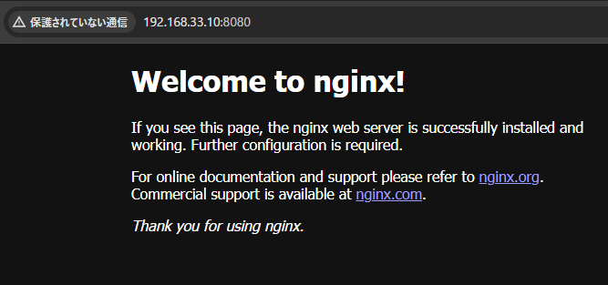
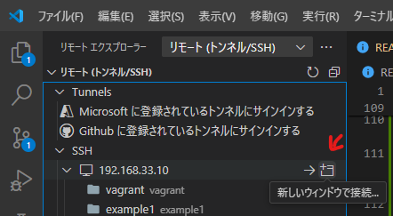

# vagrant_almalinux9_docker

## 概要

* VirtualBox に Vagrant で AlmaLinux9 + Docker 環境を構築
* VSCode の RemoteSSH で接続して開発に利用することを想定

## 目次
* 前提
* 環境
* 操作
* 動作確認
* RemoteSSH で接続
* トラブルシューティング

## 前提
1. 以下がインストールされていること
    * VirtualBox
    * Vagrant
2. ユーザーの .ssh フォルダ内に id_ed25519 と id_ed25519.pub が生成されていること
    * ユーザーの .ssh フォルダを開く
      ```
      explorer "$env:USERPROFILE\.ssh"
      ```
    * 無い場合は作る
      ```
      ssh-keygen -q -t ed25519 -C "" -N "" -f "$env:USERPROFILE\.ssh\id_ed25519"
      ```

## 環境
* Windows 10 Pro 22H2 (OS ビルド 19045.4170)  
* VirtualBox 7.0.14 r161095 (Qt5.15.2)  
* Vagrant 2.4.1  

## 操作

### 主なコマンド

| コマンド | 説明 |
| --- | --- |
| vagrant up | 起動 |
| vagrant halt | 停止 |
| vagrant destroy | 削除 |
| vagrant ssh | SSH でログイン |

### ヘルプ
```
> vagrant --help   
Usage: vagrant [options] <command> [<args>]

    -h, --help                       Print this help.

Common commands:
     autocomplete    manages autocomplete installation on host
     box             manages boxes: installation, removal, etc.
     cloud           manages everything related to Vagrant Cloud
     destroy         stops and deletes all traces of the vagrant machine
     global-status   outputs status Vagrant environments for this user
     halt            stops the vagrant machine
     help            shows the help for a subcommand
     init            initializes a new Vagrant environment by creating a Vagrantfile
     login
     package         packages a running vagrant environment into a box
     plugin          manages plugins: install, uninstall, update, etc.
     port            displays information about guest port mappings
     powershell      connects to machine via powershell remoting
     provision       provisions the vagrant machine
     push            deploys code in this environment to a configured destination
     rdp             connects to machine via RDP
     reload          restarts vagrant machine, loads new Vagrantfile configuration
     resume          resume a suspended vagrant machine
     serve           start Vagrant server
     snapshot        manages snapshots: saving, restoring, etc.
     ssh             connects to machine via SSH
     ssh-config      outputs OpenSSH valid configuration to connect to the machine
     status          outputs status of the vagrant machine
     suspend         suspends the machine
     up              starts and provisions the vagrant environment
     upload          upload to machine via communicator
     validate        validates the Vagrantfile
     version         prints current and latest Vagrant version
     winrm           executes commands on a machine via WinRM
     winrm-config    outputs WinRM configuration to connect to the machine

For help on any individual command run `vagrant COMMAND -h`

Additional subcommands are available, but are either more advanced
or not commonly used. To see all subcommands, run the command
`vagrant list-commands`.
        --[no-]color                 Enable or disable color output
        --machine-readable           Enable machine readable output
    -v, --version                    Display Vagrant version
        --debug                      Enable debug output
        --timestamp                  Enable timestamps on log output
        --debug-timestamp            Enable debug output with timestamps
        --no-tty                     Enable non-interactive output
```

## 動作確認

nginx を起動  
※`Ctrl + C` で終了 + 自動削除
```
docker run --rm -p 8080:80 nginx
```
http://192.168.33.10:8080/


## RemoteSSH で接続
1. VSCode に [Remote - SSH](https://marketplace.visualstudio.com/items?itemName=ms-vscode-remote.remote-ssh)  をインストール  
  ※ [Remote Development](https://marketplace.visualstudio.com/items?itemName=ms-vscode-remote.vscode-remote-extensionpack) に含まれているので、こちらでも可
2. `%USERPROFILE%\.ssh\config` に接続先として以下を追加  
    ※XXXXX はユーザー名
    ```
    Host 192.168.33.10
      HostName 192.168.33.10
      User vagrant
      IdentityFile C:/Users/XXXXX/.ssh/id_ed25519
    ```
3. 接続  
    

## トラブルシューティング

* RemoteSSH で接続できない。  
  また、ssh コマンドで接続すると WARNING: REMOTE HOST IDENTIFICATION HAS CHANGED! と表示される。  
  ※ssh コマンド `ssh vagrant@192.168.33.10` ※PW: vagrant  

  (原因)  
  ssh はセキュリティのため、接続した接続先と接続先情報(フィンガープリント)を保存している。  
  接続先は同じなのに接続先情報が異なる場合、なりすましなどの可能性があるので上記の警告が表示され接続できないようになっている。  
  同じ IP で別の VM を作ると、当たり前だが接続先情報が異なるので、これに引っかかる。

  (対応)  
  保存されている接続先情報を削除する。  
  ※前述のとおりセキュリティの機能なので、本来は安易に削除せず警告の原因を確認する必要があることに留意すること
  ```
  ssh-keygen -R 192.168.33.10
  ```
